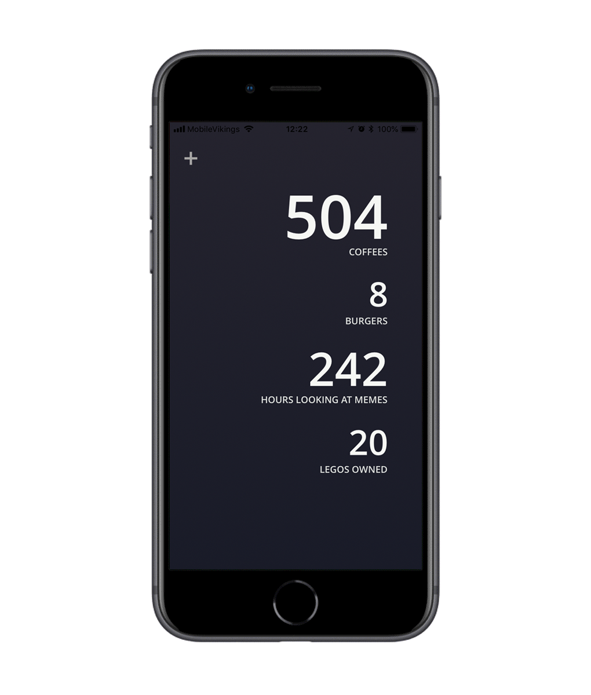

# Counter App

Simple React Native app to count things. Built using Expo.

<p float="left">
  
  &nbsp;&nbsp;&nbsp;&nbsp;
  
</p>

<!--   -->

The app is available to try in the Expo repository [here](https://expo.io/@nicmosc/counter-app).

## Running

First you need to install Expo:
```
npm install -g exp
```

Then install dependencies
```
npm install
```

Then start the expo project with
```
exp start
```


You can alternatively run it using the Expo IDE.
